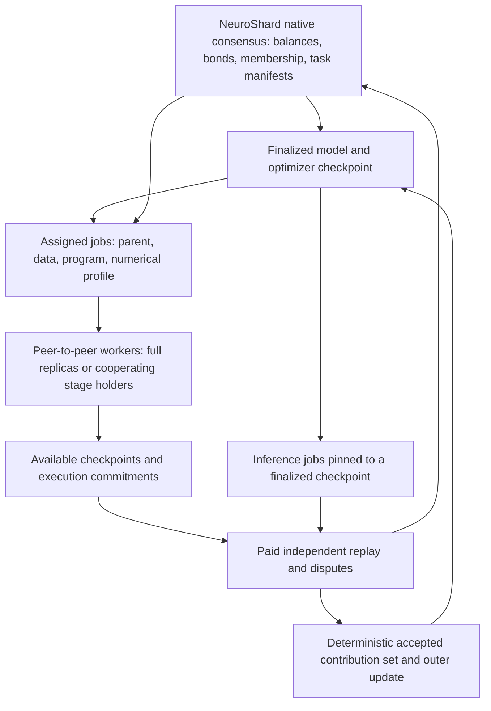

# NeuroShard: first-principles review and proposed protocol

Review date: 2026-09-10. This historical review concerns the [archived LaTeX source](archive/FINE2026_neuroshard_short_pre_evolution.tex) and [five-page PDF](archive/FINE2026_neuroshard_short_pre_evolution.pdf). The subsequent [model-evolution implementation](EVOLUTION_PROTOCOL.md) and [current working paper](FINE2026_neuroshard_short.pdf) supersede that manuscript without deleting this review's findings.

**Assessment:** permissionless collaborative training is feasible in some configurations. The current NeuroShard components do not yet compose into a secure decentralized training system. The strongest direction is a sovereign chain that agrees on precisely specified, auditable training jobs and model checkpoints, with a separate peer-to-peer compute network. The research problem is making that composition economical for small, mutually untrusted devices.

**User requirement:** NeuroShard runs its own consensus from day one. This proposal does not depend on another blockchain for settlement. An established consensus algorithm can run on NeuroShard's own network; sovereignty does not require inventing another consensus algorithm.

This review distinguishes repository observations, elementary deductions, proposals, and open research problems. The observations below concern the legacy prototype audited at the start of this work. A subsequent [native-chain reference demo](REFERENCE_DEMO.md) now implements the smallest computation-to-reward path; its measured scope is recorded below. The larger permissionless protocol is not implemented or proved secure end to end.

**Implemented reference, 2026-09-10:** four native CometBFT validators, two actual model-stage workers, deterministic full-model replay, and atomic development-token issuance. The [recorded acceptance test](eval/results/demo_reference.json) completed 15 training steps, lowered fixed held-out batch loss from 5.7411 to 4.1096, issued exactly 15 development NEURO, rejected forged/replayed claims, progressed with one validator offline, halted with two offline, and recovered consistent blocks/model/balances/inference after restart. Twenty unit tests cover computation equivalence, accounting, malformed claims, and interrupted application commit recovery. This establishes a local reference; validator admission, independent ownership, scalable verification, availability, and production economics remain open. The legacy paths analyzed below are unchanged.

## 1. Define what must actually work

For this project, “fully decentralized” should have operational meaning:

- Anyone can discover the network, obtain published state, submit an eligible job contribution, or bond resources to enter a protocol role without an operator's approval.
- No permanent authorizer, coordinator, cloud bucket, evaluator, or privileged key is necessary for normal operation. Temporary elected proposers and job initiators are allowed and replaceable.
- NeuroShard's own consensus determines payments, task assignments, disputes, membership changes, and the canonical model history.
- Clients can independently verify the history and retrieve the data required to verify a computation.
- Security states an adversarial **resource** bound, connectivity assumptions, and an execution-verification assumption. Counting public keys is insufficient.

This definition does not imply that every device can train every layer profitably, that stake ownership is egalitarian, that prompts are private, or that a single-node genesis is adversarially decentralized. Those are distinct properties. Public entry and resource concentration must be measured separately.

Specify four different guarantees: consensus agreement, execution correctness, learning quality, and economic sustainability. Agreement on a hash does not establish any of the other three.

## 2. What the existing evidence establishes

The repository contains useful mechanisms, and the manuscript already acknowledges several limitations. The gap is chiefly between the composition claimed in the architecture and the conditions exercised by the experiments.

| Evidence | What it supports | What it does not establish |
|---|---|---|
| `docs/eval/run_experiments.py`, E1 | Small-model loss versus outbound update payload under a common model state and controlled workers | Actual WAN traffic, pipeline traffic, audit traffic, equal wall-clock efficiency |
| E2 | Resistance to specified sign-flip/noise attacks on complete worker updates | Security against malicious pipeline stages, Sybils, adaptive attacks, or arbitrary heterogeneous local trajectories |
| E4 | Serialization/signature cost and one forward/backward computation | Challenge discovery, state retrieval, full trajectory replay, or binding on-chain adjudication |
| LAN reports | Processes train, survive crashes, and restart in the tested configuration | Safety under conflicting histories, recovery of a uniquely held pipeline shard, or decentralized canonical checkpoint agreement |

The restart report identifies all three participants as full nodes holding layers `[0, 1]`. Its decreasing local losses and step counts do not show that a partitioned model remained jointly correct after a shard failed. New gates must compare agreed state roots and common held-out evaluation.

**Numerical correction:** `e1_convergence.json` records synchronous loss 1.97629465, uncompressed H=50 loss 2.04359961, and compressed H=50 loss approximately 2.296001. The increases are 3.406% and **16.177%**, respectively. The compressed payload reduction is 527.333×. The original short manuscript's +12% compressed-loss claim does not match the stored artifact. The revision uses +16.2% and preserves the raw results.

Run `python3 docs/eval/audit_fundamentals.py` to reproduce the numerical examples and this artifact check. The output is also recorded in `docs/eval/results/fundamentals_audit.json`. These calculations are not new distributed experiments.

## 3. The failures that must be fixed in the theory

### 3.1 A bound on malicious nodes does not bound malicious pipeline outputs

For a pipeline of L independently selected stages, each malicious with probability alpha, the probability of at least one malicious stage is

\[
\rho = 1-(1-\alpha)^L.
\]

This is an elementary placement calculation, assuming one malicious stage can invalidate the unverified pipeline contribution. It describes potentially corrupted pipelines, not a claim that every such pipeline will successfully poison a model.

| Malicious node fraction | Four-stage pipeline | Eight-stage pipeline |
|---|---:|---:|
| 5% | 18.5% | 33.7% |
| 10% | 34.4% | 57.0% |
| 20% | 59.0% | 83.2% |
| 30% | 76.0% | 94.2% |

Without random placement, an adversary can deliberately spread across pipelines. With equally sized, disjoint pipelines, one bad stage per pipeline can expose a fraction up to `min(1, alpha * L)`. Shared stages or repeated peer reuse introduce further correlations. Speed tiers and DHT discovery do not give independent assignment.

A malicious stage can alter activations sent forward or adjoints sent backward. An honest layer holder then computes an update using bad inputs. Thus even layer-wise aggregation can receive contaminated vectors from otherwise honest nodes. The relevant bound is the fraction of compromised contributions **in each actual aggregation set**, after dependency propagation and omissions.

**Repair:** treat a complete training job as a failure domain until verification can attribute faults to individual stages. Either verify its end-to-end computation before canonical acceptance or explicitly assume a minority of compromised complete jobs. To gain finer fault containment, commit the complete dependency graph, including boundary activations and adjoints, and verify the operations producing those inputs. A signed tensor authenticates its sender, not its mathematical correctness.

### 3.2 The async fallback can optimize the wrong objective

For a model split as `h_(l+1) = f_l(h_l; theta_l)`, a correct stage gradient requires both its forward input and its backward adjoint:

\[
\nabla_{\theta_l}\ell
= \left(\frac{\partial f_l}{\partial\theta_l}\right)^\top
\frac{\partial\ell}{\partial h_{l+1}}.
\]

Owning one layer and the raw training text does not provide either tensor in general. An isolated partial model cannot manufacture a valid language-model gradient just by running locally.

In `src/neuroshard/core/swarm/quorum.py`, `AsyncTrainer._async_training_loop` includes branches using random hidden inputs and `hidden.pow(2).mean() * 0.01` as a proxy objective. The same loop computes a pseudo-gradient and calls `_submit_to_cohort_sync`. Reducing that proxy can shrink representations without improving the language model. This is a concrete mismatch between the advertised objective and executable work, independently of adversarial behavior.

**Repair:** admit only a full valid model objective, or an explicit stage task with versioned and authenticated forward/backward inputs. Otherwise assign storage, verification, retrieval, or a separately evaluated auxiliary learning task. A proxy-loss update must not enter the canonical LM optimizer as though it were an LM gradient.

### 3.3 Signed epochs and gossip are not consensus

Two honest nodes can see different timely updates, compute different robust aggregates, and each sign a hash-linked history. All signatures can be valid. Neither a Merkle tree nor a gradient median decides which history is canonical.

Repository observations:

- `EpochManager._finalize_epoch` in `core/consensus/epoch.py` marks an epoch finalized locally, including an unsigned branch when the selected proposer is another node. This path has no distributed commit certificate.
- `DiLoCoGossipProtocol._collect_contributions` in `core/swarm/diloco.py` returns locally received contributions on a timeout; its aggregation helper takes a mean. This is not the same path as the standalone robust-estimator experiment.
- `QuorumTrainer._exchange_and_aggregate` in `core/swarm/quorum.py` has a separate trimming implementation: approximately 10% per tail for larger sets, and averaging for two contributors. It is not the experiment's fixed 30% trim policy.
- `select_validators_for_proof` in `core/economics/ledger.py` uses local `random.random()` and a stake-plus-random score, not a shared, verifiable selection transcript.

**Repair:** a NeuroShard-native state machine must commit the parent checkpoint, ordered contribution manifest, exact aggregation rule, and resulting state. Specify lock/commit rules and epoch reconfiguration. DHT contents are discovery hints; they do not determine consensus membership or finality.

### 3.4 Concave per-identity influence rewards splitting

For B batches, one identity has nominal influence `sqrt(B)`. Splitting equally across k identities yields

\[
\sum_{i=1}^k\sqrt{B/k}=\sqrt{kB}.
\]

Requiring k stakes imposes a cost but does not remove the advantage for someone who can pay it. Equal-weight averaging is also vulnerable if the adversary can mint participants freely. Reputation and benchmark tiers do not certify distinct owners. The classic [Sybil attack analysis](https://www.microsoft.com/en-us/research/publication/the-sybil-attack/) motivates stating the scarce-resource assumption explicitly.

**Repair:** make consensus power linear in bonded resource and make contribution eligibility a protocol-assigned resource-backed slot. Splitting ownership of the same total stake should not change total voting power or expected assignments, apart from disclosed rounding/minimum-bond effects. This limits identity multiplication; it does not stop wealthy owners from having proportionate influence. A training-slot fault bound is still separate from the validator-stake fault bound.

Do not claim that a concave rule both enforces egalitarian control and remains Sybil resistant without another identity mechanism.

### 3.5 PoNW needs a transition predicate, not just a commitment format

For deterministic replay, a training state generally contains

\[
S_t=(\theta_t,m_t,v_t,\text{optimizer counters},\text{RNG state},
\text{data cursor},\text{scheduler},\text{compression residuals},\ldots).
\]

The job additionally fixes tokenizer, graph and parameter layout, data manifest/order, numerical operators, learning-rate policy, precision, loss scaling, and pipeline schedule where relevant. Tied parameters must have one canonical representation. Restore the bytes whose hash is committed; a hash itself is not restorable state.

The task boundary must distinguish local training from the outer optimizer. After an outer synchronization, the next local start is the committed aggregate result, not necessarily the previous local end. A literal chain of local end/start hashes therefore needs an explicit synchronization transition and a policy for retaining or resetting Adam moments and error-feedback residuals. Resetting them changes the optimizer and needs its own convergence measurement.

Repository observations:

- `ProofVerifier._verify_challenge` reconstructs fields and calls `verify_work_content`; it does not restore and replay a claimed trajectory.
- `SpotCheckVerifier.verify_commitment` recomputes using its current model and accepts either hash equality **or** a loss difference below 0.01. Similar loss is not an execution proof.
- `NEUROLedger._verify_challenge_claim` mostly checks rates; its deeper-check stub supplies an empty model hash, which can trigger rejection unrelated to replay.

**Repair:** specify `S_(t+1) = T_J(S_t)` for a committed program J. A job may be accepted only by a stated verification rule. A one-batch replay is evidence for that transition only. It is not evidence that all claimed previous steps happened.

### 3.6 TOPLOC is not a drop-in training fraud proof

[TOPLOC](https://arxiv.org/abs/2501.16007) addresses inference through compact activation fingerprints, with empirical hardware-tolerant detection results. That does not establish a consensus-safe predicate for an arbitrary AdamW trajectory. A tolerance relation can accept different outputs and need not be transitive; consensus still needs one adjudication rule.

[Verde](https://arxiv.org/abs/2502.19405) is directly relevant: reproducible ML operators plus disputes narrowed from a training trajectory to an operation. Its guarantee needs an honest competing execution and a correct referee. Reducing the referee's work does not eliminate the cost of discovering disagreement through independent computation. Its reported runtime overheads are not measurements of NeuroShard, and adapting it to distributed pipeline dependencies remains work.

**Repair:** start with a supported deterministic execution profile and full replay on a small model. Then investigate an open reproducible runtime and bounded operation-level adjudication. Hardware eligibility is a public technical requirement, not a participant whitelist. Measure honest disagreement across hardware before enabling slashing for numerical mismatch.

### 3.7 Sampling, collateral, and verifier incentives must be analyzed together

Let d = p*q be effective detection probability, R the escrowed reward, P collectible penalty beyond forfeiting R, C_h honest compute cost, and C_f fraudulent compute cost. Ignoring common fees, with no false positives and no reward paid when caught,

\[
U_h=R-C_h,\qquad U_f=(1-d)R-dP-C_f.
\]

Honest work beats fraud when

\[
d(R+P)>C_h-C_f.
\]

Fraud is worse than abstaining when `dP > (1-d)R - C_f`. These are different comparisons. At d=0.05 and C_f=0, the latter needs **P > 19R**. A promised penalty is irrelevant if the account's unencumbered collateral cannot pay it. Reserve collateral across all simultaneous claims and keep it locked through disputes and withdrawal delays.

The old `0.95^100` example concerns the chance that **all** 100 fraudulent claims evade examination, assuming every examination detects fraud. With independent claims and no shared clawback, the expected number unexamined is still 95. Detecting one claim is not a protocol-wide integrity guarantee.

If a trace has T transitions, c are invalid, and s are checked uniformly without replacement after commitments are fixed, then

\[
q=1-\frac{\binom{T-c}{s}}{\binom{T}{s}}.
\]

One invalid transition in a 100-step trace is found by five checks with probability only 5%. An attacker may make a single invalid jump followed by correctly computed transitions. Chaining alone does not prevent this. An initial full-claim sampling probability p reduces effective detection further.

Audit assignments must be unpredictable until commitments are fixed, and the adversary must not be able to grind identities/commitments to select auditors. A locally seeded random generator or a proposer-controlled block hash does not provide that guarantee. Do not lower audit security because the number of advertised identities increased.

Pay for verification even in honest periods: a fraud-bounty-only market loses its incentive when fraud becomes rare. Budget base audit fees, availability checks, and dispute service; measure missed audits and auditor collusion. Penalize objectively false execution claims or equivocation, not merely disagreement with a voting majority. `NEUROLedger.check_and_slash_bad_validators` currently implements the latter kind of majority-based decision.

These inequalities concern rational profit-seeking attacks. They do not rule out sabotage funded by an external objective worth more than the bond.

### 3.8 Memory pooling does not remove network costs

An uncompressed stage boundary for microbatch size b, context length s, width d, and a bytes per activation element carries approximately

\[
V_{\rm boundary}=2bsd a
\]

bytes for its forward activation and backward adjoint. With b=1, s=2048, d=4096, a=2, this is **32 MiB per boundary per microbatch**. Serializing that traffic over a 100 Mbit/s budget takes 2.68 seconds before compute and propagation latency. Full-duplex links, microbatch overlap, compression, and pipeline schedules affect steady-state throughput; this is a traffic/serialization illustration, not a universal throughput bound.

DiLoCo reduces communication **between complete local training groups**. It does not divide their internal activation traffic by H. Speed matching also needs bandwidth, latency, memory, activation size, and recovery cost—not just milliseconds per layer.

For an 8B model, fp32 weights plus two Adam moment tensors alone occupy 96 GB. Fetching those over 100 Mbit/s takes 7,680 seconds, or 128 minutes, without overhead. A universal ten-minute challenge window cannot assume arbitrary cold full-state replay at that scale. Checkpoint sharding, prepositioned auditors, storage payments, and smaller dispute units are necessary.

Use a complete cost model: training compute + inner-pipeline communication + outer exchange + replicated state + audits + disputes + recovery + chain overhead. The 527× result counts outbound pseudo-gradient payload only.

### 3.9 Robust estimation has narrower guarantees than “30% Byzantine tolerant”

The [trimmed-mean/median analysis](https://proceedings.mlr.press/v80/yin18a.html) depends on statistical and optimization assumptions, not only a contamination percentage. Coordinate-wise breakdown resistance does not guarantee preservation of semantic behavior or immunity to small coordinated backdoors. The [ALIE attack](https://arxiv.org/abs/1902.06156) provides a relevant stronger baseline than large sign flips.

Local AdamW trajectories of unequal lengths, non-i.i.d. shards, stale base states, compression, and persistent residuals do not automatically satisfy a theorem about comparable gradient estimates. Dividing a multi-step AdamW update by its batch count does not make it an unbiased gradient at the common initial state. The Byzantine consensus threshold of one third is unrelated to the breakdown fraction of an estimator.

**Repair:** begin with a shared objective, committed parent, fixed H, controlled data assignment, and explicit optimizer state. Do not admit arbitrary stale updates to the canonical aggregation set. Increase flexibility only after convergence and attack tests. For an estimator that needs at least a configured population, insufficient responses must defer the update; silently averaging fewer responses changes the security assumption.

## 4. A concrete sovereign protocol to investigate

This is a proposed reference architecture, not a completed protocol proof.



### 4.1 Native consensus and bootstrap

Use an established BFT state-machine replication algorithm on **NeuroShard's own validators, genesis, ledger, and networking**. [HotStuff](https://arxiv.org/abs/1803.05069) is a relevant reference for locked voting, commit certificates, and progress under partial synchrony. It is not by itself a permissionless membership mechanism.

Proposed membership: bonded native stake, fixed voting weights during each epoch, and changes authorized by the previous finalized epoch. Consensus power is linear in stake. Require less than one third Byzantine voting weight; certificates require strictly more than two thirds, under the chosen protocol's full locking and commit rules. A certificate threshold alone is insufficient. Start without committee sampling to avoid another selection assumption. Scaling the validator set is a later engineering requirement.

Transactions use deterministic serialization, integer token accounting, replay protection, and bounded execution. ML tensors remain outside ordinary blocks with binding commitments. Disputes use bounded deterministic transitions executed by validators; it must be possible to check every such transition within a declared memory/time limit. A signed ML evaluator verdict is an additional trust assumption unless its result can be challenged using this execution rule.

Unverified PoNW claims cannot mint immediately usable consensus stake. Settled rewards may become stake only through explicit delayed activation. Live disputes freeze their reserved collateral. Validator exits need evidence retention, withdrawal delay, and a specified long-range defense / checkpoint synchronization policy.

**Bootstrap is unresolved policy, not a free cryptographic primitive.** A PoS genesis requires an explicit allocation and an honest-stake assumption from launch. A creator holding all stake gives a sovereign development chain but not decentralized security. If an open resource-based launch without an initial stake allocation is required, a separate native hash-PoW bootstrap is an alternative research/design choice. Do not claim that unverified useful training solves this bootstrap: that would make security depend on the computation it is supposed to verify.

The revised short paper chooses a native bonded BFT design as its working proposal. Allocation, reconfiguration details, long-range protection, and anti-grinding randomness remain explicit design obligations. A consensus algorithm name does not discharge them.

### 4.2 The canonical object is a task transition

A task commitment should bind at least:

```
chain_id, protocol_version, job_id, slot_id, round_id
parent_checkpoint_root, model_graph_root, tokenizer_root
data_manifest_root, sample_order_or_seed, exact_work_extent
local_optimizer_state_policy, optimizer_config, numerical_profile
input_dependency_roots, required_output_layout
commit_deadline, reveal_deadline, audit_rules, availability_deadline
reward_budget, reserved_bond, expiry_and_dispute_rules
```

The full task execution commits its resulting state and trace before audit challenges are drawn. The parent task and parameter layouts prevent replay across rounds and models. Each slot can earn once for the authorized computation; signatures alone cannot prevent copying another participant's deterministic output. Distinct assigned workloads and commit/reveal timing reduce duplicate claims, but cannot prove which physical GPU did the work. Pay for delivery of the assigned computation, allowing subcontracting, rather than claiming proof of device-local energy expenditure.

Local steps and outer synchronization are different transitions. The outer transition commits an ordered list of accepted jobs, rejects mismatched parents, fixes decompression and tie-breaking, and updates the canonical model plus outer optimizer state. If sharded aggregation is used, every shard must reference that same manifest.

Initially freeze graph, tokenizer, data policy, and H for a run. A topology change replaces a host; an architecture change creates a new versioned training specification with a deliberate state migration. These events must not be conflated.

### 4.3 Verification and model finality

For the first tiny reference system, pay independent workers to fully replay every admitted job with identical numerical semantics. Disagreement invokes deterministic replay through the chain's bounded execution model. This is expensive but makes correctness falsifiable. Redundant copies need a declared honest-executor assumption and anti-copying operational design; counting multiple keys does not establish independence.

A larger system can investigate interactive disputes that isolate an operation. The terminal operation must itself be small enough for a validator; “one matrix multiplication” is not automatically a cheap transaction. Operation tiling, memory commitments, numerical rounding, and timeout behavior belong in the protocol.

Keep accepted model state separate from provisional execution. In the simple version, descendants use a checkpoint only after its jobs and aggregate pass the specified verification/finality rules. The chain can keep producing ordinary blocks while training waits. If speculative descendants are introduced, track a dependency DAG and invalidate/recompute **all** descendants of an invalid transition. Slashing a worker does not unpoison a model already used for subsequent training.

Availability obligations cover both the challenge interval and the applicable dependency/dispute lifetime. Hashes do not make model weights, optimizer state, or training data available. Store replicated chunks, authenticate retrieval, specify deadlines and retrieval evidence, and budget the storage/egress. Delivery disputes must distinguish objective failure to answer a protocol challenge from an unverifiable claim that a peer was slow.

### 4.4 Conditional guarantees that can actually be stated

Assume a valid starting state, safe native agreement, binding task/dependency commitments, deterministic execution, and no canonical use before the declared acceptance rule completes. If every admitted task and outer transition is correctly verified, induction through the dependency graph shows that the resulting checkpoint is the prescribed computation. This is an elementary conditional correctness argument; it is not a new cryptographic proof system.

More generally, let delta_c bound consensus safety failure and epsilon_j bound acceptance of an invalid transition at check j, conditional on a valid preceding history. Over K checks, a union bound gives

\[
\Pr[\text{conflicting or invalid canonical history}]
\leq \delta_c+\sum_{j=1}^{K}\epsilon_j.
\]

No independence is needed, but the conditional bounds must survive adaptive adversaries. Count aggregation and dependency checks, not just worker receipts. Withholding must defer acceptance. A failure probability per check that appears small can still be unacceptable over millions of steps. Nominal audit rates do not establish these epsilon bounds.

This also exposes a useful simplification: if every task is fully verified under a fixed objective and data assignment, arbitrary incorrect updates are excluded by execution verification. Robust aggregation then addresses a different residual threat or optimization choice; it is not needed to authenticate the very same already-verified operations. An optimistic/sampled design gives up that reference guarantee and must bound the remaining accepted corrupt jobs. Neither variant proves that the prescribed data or learning algorithm is good.

For learning quality, consider a simpler SGD reference before attempting a theorem for local AdamW. If F is L-smooth, the update is `theta_next = theta - eta * (grad F(theta) + e)`, and `0 < eta <= 1/L`, then

\[
F(\theta_{\rm next})\leq F(\theta)
-\frac{\eta}{2}\|\nabla F(\theta)\|^2
+\frac{\eta}{2}\|e\|^2.
\]

Proof: apply the smoothness upper bound `F(theta + u) <= F(theta) + <grad F, u> + L ||u||^2 / 2`, substitute the update, and upper-bound `L eta^2` by eta. The cross terms cancel. This is a standard elementary descent bound, not an assertion that the current optimizer satisfies it. The project must bound stochastic, heterogeneous-data, compression, staleness, and residual adversarial contributions to e, or develop the appropriate different argument for its chosen optimizer. Numerical execution correctness cannot replace that analysis.

### 4.5 Useful roles for heterogeneous participants

Let locality determine who shares frequent activation traffic; let the protocol determine accepted tasks and updates. A training group can be a single full-model node or a small cooperating pipeline, but its aggregate is one auditable job. Lower-bandwidth devices can provide checkpoint chunks, data retrieval, deterministic small-operation verification, or independently verifiable inference/rollout jobs.

**Research proposal: versioned gradient tasks.** Supply a stage holder with `(parent state, h_l, adjoint_(l+1), layer range)` and ask it to compute a specified local vector-Jacobian product. This makes partial-model work mathematically defined. However, the forward/backward inputs must themselves be verified against the same execution graph. Once parameters change, old tensors are stale; either reject them, use an explicitly analyzed bounded-delay optimizer, or obtain new inputs. The proposal does not remove bandwidth costs or make a multi-step local trajectory independent of other stages.

**Alternative research branch:** independent expert/adapter training followed by evaluated distillation can offer coarser tasks to slow devices. That changes the learning algorithm and requires quality, poisoning, and efficiency comparisons. Keep it a separate experiment; do not silently treat it as equivalent to dense-model pretraining.

### 4.6 Inference shares settlement, but has its own correctness contract

Inference jobs pin the checkpoint, tokenizer, prompt, sampling algorithm and randomness, decoding parameters, and output limit. Streaming uses signed cumulative receipts with a cap and a single sequence so replay cannot collect twice. The payment schedule and dispute policy must say how much service can be unpaid or provisionally paid at once.

Verification asks whether the declared model produced the declared computation. It does not establish that the answer is true, useful, or safe. Teacher-forced checks of generated token sequences can be more parallel than autoregressive generation, but validating logits alone does not prove sampling compliance; the sampling rule and random stream must also be bound. TOPLOC can be evaluated as an inference screening mechanism without being promoted to the canonical training judge.

A permissionless distributed inference pipeline does not imply prompt privacy. Even if transport is encrypted, workers process tensors that may reveal inputs. Confidential inference would require a separate threat model and mechanisms. Also pin KV-cache ownership/version and recovery behavior: a stateful session cannot switch model versions between tokens.

### 4.7 Pay for a bounded task, measure usefulness separately

Do not equate `batches * layers` with economic or scientific usefulness. Batch size, sequence length, width, architecture, and data quality change the work. A task fixes the amount and type of computation; its budget comes from an inference client, a training sponsor/treasury, or a stated issuance schedule.

Let correct execution earn the agreed task payment. Evaluate learning quality at the model/run level using common held-out data. If utility bonuses are introduced, test their vulnerability to held-out-set overfitting, duplicate updates, collusion, and short-term loss gaming. Valid SGD steps need not each reduce validation loss.

Token issuance is a funding policy, not evidence of demand. Model weights that anyone can download do not force future inference customers to pay the network; that is an explicit business-model tradeoff. Sustainable training must account for external demand or a continuing subsidy. Stake multipliers and scarcity bonuses should be added only after the basic service budget balances.

## 5. Where there may still be a research contribution

The general claim “permissionless training is absent from prior work” is no longer defensible. This does not settle the more demanding combination NeuroShard targets.

| Primary source | Relevant result / mechanism | Remaining distinction for NeuroShard |
|---|---|---|
| [Gauntlet, May 2025](https://arxiv.org/abs/2505.21684) | Reports permissionless 1.2B training and contribution-based incentives | Compare validation/admission assumptions and canonical-state coordination, rather than describing Bittensor only as output scoring |
| [Covenant-72B, March 2026](https://arxiv.org/abs/2603.08163) | Reports permissionless 72B pretraining; the described peers require at least eight B200 GPUs and use Cloudflare R2 exchange | Small-device participation and provider-independent communication remain meaningful differences to investigate |
| [Agora, July 2026](https://arxiv.org/html/2607.13332v1) | Describes internet pipeline sharding; its documented deployment includes a singleton Authorizer granting renewable credentials | Removing discretionary admission while providing execution security is a specific distinction, not a claim that heterogeneous sharding is new |
| [Verde, February 2025](https://arxiv.org/abs/2502.19405) | Reproducible ML execution and refereed disputes | Adaptation to sharded dependencies, availability, and native settlement needs evaluation |
| [TOPLOC, January/May 2025](https://arxiv.org/abs/2501.16007) | Compact, hardware-tolerant inference fingerprints | Training-state verification and objective fraud adjudication require separate evidence |

These are reports by the respective authors, not an independent reproduction of their deployments. The distinctions are architectural observations and research directions, not established novelty claims.

The most promising paper question is:

> Can a sovereign, permissionless protocol make independently owned model shards behave like auditable training workers, with explicit fault containment and a measured cost of verification?

Potential contributions would be a proven or experimentally supported bound on stage-fault propagation, a complete state/dependency commitment protocol, and measured training quality per total resource cost under real attacks. Adding blockchain to DiLoCo is insufficient by itself.

## 6. Experiments that decide whether to proceed

Do these in order. A large public GPU launch is premature before the first three gates work.

The new reference covers two-stage objective equivalence, native agreement under validator outages, and full-replay reward accounting. It does not yet cover the full rows below: equivocation, network partitions, missing data, Adam-state disputes, collateral, and independent hardware remain untested or unimplemented.

| Gate | Experiment | Required evidence |
|---|---|---|
| 1. Objective correctness | Compare a two-stage pipeline against the same complete model, batch, and optimizer state; exercise every async role | Matching gradients under the declared numerical profile; no proxy-loss updates admitted as LM work |
| 2. Native agreement | Four equal-weight validators; one equivocates, crashes, or sends messages selectively; then partition 2–2 and restore connectivity | No conflicting finalized histories; 2–2 partition pauses finality; progress after communication and enough honest voting weight recover |
| 3. Replay and settlement | Forge batch counts, data, optimizer moments, boundary tensors, and end states; withhold chunks; duplicate claims; reuse reserved bonds | Correct rejection/expiry, deterministic dispute result, no double payment or unsupported slashing; independent reproduction of accepted state |
| 4. Composed attacks | Vary malicious stages and complete jobs separately; target placement; sign flip, ALIE, small backdoors, stale updates, and strategic omission | Attack success, false rejection, effective contaminated-input fraction, common held-out loss, and at least several seeds |
| 5. Honest hardware diversity | CPU/GPU stacks, supported architectures, precisions, and operator schedules | Zero unexplained adjudication disagreement in the supported profile; measured reproducibility cost |
| 6. Complete systems cost | WAN latency/bandwidth limits and churn with all checkpoint, audit, recovery, and consensus traffic included | Time and total bytes/compute to a fixed quality target against appropriate baselines |
| 7. Inference and economics | Model/prompt substitution, cache/version mistakes, stream replay, service aborts, and auditor inactivity | Correct task billing and verification, measured service latency, and a budget covering compute plus verification |

Four machines controlled by one researcher test protocol behavior, not decentralized ownership. Likewise, repeated model-training seeds establish neither cryptographic soundness nor adversarial resource independence.

The local reference is the first executable baseline. Its next gate is reproducing accepted history on independent machines. Then optimize communication, expand hardware support, and scale the model without changing the meaning of an accepted contribution.

## 7. Reproducing this review's artifacts

From the repository root, the numerical audit uses only Python's standard library:

```bash
python3 docs/eval/audit_fundamentals.py
```

The existing figure generator reads the unchanged E1–E4 experimental JSON files. It now labels outbound update payload accurately, removes stray backslashes in labels, and shows a marker for H=250's single recorded evaluation point. Regenerating figures does not rerun training:

```bash
MPLCONFIGDIR=/tmp/neuroshard-matplotlib venv_build/bin/python docs/eval/make_figures.py
```

To compile the manuscript covered by this historical review without changing the repository's LaTeX auxiliary files:

```bash
mkdir -p /tmp/neuroshard-paper-review
cd docs
pdflatex -interaction=nonstopmode -halt-on-error -output-directory=/tmp/neuroshard-paper-review archive/FINE2026_neuroshard_short_pre_evolution.tex
pdflatex -interaction=nonstopmode -halt-on-error -output-directory=/tmp/neuroshard-paper-review archive/FINE2026_neuroshard_short_pre_evolution.tex
```

Validation for this review covers the calculations, recorded experimental values, reference resolution, PDF compilation/page count, and visual presentation. No new model training, adversarial network run, or production-code fix is claimed.
