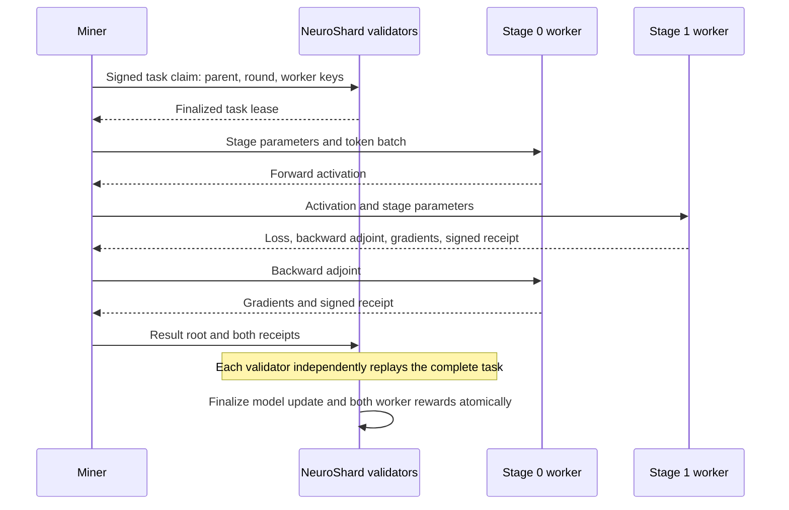

# NeuroShard native-chain reference demo

This reference connects actual sharded language-model training to verified model updates and native development-token rewards. Four independent CometBFT processes run a NeuroShard genesis and chain. Two worker processes each hold one model stage. Every validator independently replays the complete learning task before it accepts the update and payment.

It is the executable baseline for [the archived short paper](archive/FINE2026_neuroshard_short_pre_evolution.pdf). It uses the repository's NeuroLLM and cryptographic primitives, with a bounded application state machine under `src/neuroshard/demo`. The legacy `neuroshard-node` trainer still has the separate issues recorded in [the fundamentals review](FUNDAMENTALS_REVIEW.md). See [model evolution](EVOLUTION_PROTOCOL.md) for the later full-model work.

## Run it in this checkout

The existing `venv_build` environment and `.neuroshard/tools/cometbft` binary are prepared for this workspace. From the repository root:

```bash
venv_build/bin/python scripts/demo_neuroshard.py up
venv_build/bin/python scripts/demo_neuroshard.py mine --steps 12
venv_build/bin/python scripts/demo_neuroshard.py status
venv_build/bin/python scripts/demo_neuroshard.py infer 'ROMEO:' --max-tokens 24
venv_build/bin/python scripts/demo_neuroshard.py down
```

`up` initializes a new development chain on first use and resumes it on later uses. `mine` assigns tasks, calls the two workers, and submits their signed results. `status` reports the accepted training round, model commitment, held-out loss, and worker balances. Balances use integer atoms: **1,000,000 atoms = one development NEURO**. The default home is `.neuroshard/reference`; keys, logs, databases, and chain history stay there and are ignored by Git. Services bind to localhost.

To use another home or avoid a port collision:

```bash
venv_build/bin/python scripts/demo_neuroshard.py --home .neuroshard/my-demo up --base-port 30650
venv_build/bin/python scripts/demo_neuroshard.py --home .neuroshard/my-demo mine --steps 12
venv_build/bin/python scripts/demo_neuroshard.py --home .neuroshard/my-demo down
```

The launcher is a convenience for local process management. Block proposals and finality run between the CometBFT nodes; the launcher does not decide them. A miner coordinates its own assigned task and has no privileged application key.

## Reproduce from a fresh checkout

The recorded execution profile uses Linux x86_64, Python 3.10, PyTorch 2.9.1 CPU, and CometBFT 0.38.26. Install Go separately, then:

```bash
python3.10 -m venv .neuroshard/venv
.neuroshard/venv/bin/python -m pip install -r docs/demo-requirements.txt
bash scripts/install_demo_consensus.sh
.neuroshard/venv/bin/python scripts/demo_neuroshard.py check --output .neuroshard/check-result.json
```

The Go installation command pins the upstream engine version. An existing binary can instead be selected with `COMETBFT_BINARY=/absolute/path/to/cometbft`. Genesis binds the data digest, initial model, optimizer, numerical profile, reward limits, and relevant Python source hashes. Changes to those inputs require a fresh development home. This explicit profile supports testing; bitwise agreement across different CPU families, operating systems, or accelerator kernels remains unestablished.

Generated ABCI stubs are checked in. If the protocol file changes, regenerate them with `grpcio-tools==1.76.0`:

```bash
python -m grpc_tools.protoc -I src --python_out=src --grpc_python_out=src src/neuroshard/demo/abci.proto
```

The [minimal ABCI schema](../src/neuroshard/demo/abci.proto) preserves CometBFT's service paths and field numbers. It implements current-state queries and block replay; snapshot state sync, historical state queries, and query inclusion proofs are not implemented. Requests for unsupported proof/history semantics are rejected.

## What a mining round means

The model is a 34,976-parameter, two-layer, byte-level NeuroLLM. A task performs one next-token cross-entropy step on a deterministic TinyShakespeare batch of four sequences of 32 bytes. SGD uses learning rate 0.1, no momentum, and no dropout. The corpus's last 5% is held out; the displayed validation metric is one fixed, small held-out batch. This tests learning behavior and agreement, not language-model capability.



1. **Assign.** An unregistered miner key claims the current round and parent. The claim fixes the two eligible worker keys and creates a unique task ID. The lease expires after 60 blocks; an abandoned task can then be reassigned.
2. **Execute.** Stage zero holds the embedding and first decoder layer. Stage one holds the second decoder layer, final norm, and output head. They exchange actual forward activations and backward adjoints through the miner. Stage zero recomputes its forward pass for backpropagation. No random hidden input or proxy objective contributes to this model update.
3. **Verify.** Each validator reconstructs the public batch and independently executes the complete model from its local accepted checkpoint. It checks both workers' signatures and exact commitments to the task, boundary tensors, gradients, loss, and resulting model. Replication reconstructs the result; a signature alone never authorizes a reward.
4. **Settle.** An accepted transaction advances the model one round and credits 500,000 atoms to each stage's key. Model, completed task, and balances share one application commit. Content-based transaction IDs reject a re-signed duplicate. Wrong parents, expired tasks, incorrect results, and invalid receipts earn no issuance.

Genesis authorizes at most 1,000 rewarded tasks, for a development supply limit of 1,000 NEURO. These are reference constants for testing accounting, **not a proposed public supply schedule**. Validators receive no rewards in this version. There are no transfers, staking, slashing, token sales, or mainnet balances. A worker may operate both stages; splitting one operator across keys cannot increase the fixed per-task reward.

Inference queries execute the accepted checkpoint at a validator and return its model root. The tiny model will generally generate poor text. Inference currently tests consistency of the accepted model; distributed inference payments and pipeline serving are separate work.

## Verification

```bash
PYTHONPATH=src venv_build/bin/python -m pytest tests/test_verified_demo.py -q
venv_build/bin/python scripts/demo_neuroshard.py check --output .neuroshard/check-result.json
```

The unit tests compare every gradient and boundary receipt from the two-stage computation with full-model execution across successive updates. They also cover forged signed receipts, wrong chains/parents, expired leases, issuance limits, duplicate payments, malformed tensors, and a crash between ABCI finalization and durable commit.

The acceptance command creates a fresh chain and runs real processes. It trains, submits incorrect work, attempts repeated payment, stops one validator and trains again, stops a second validator and checks that a queued valid transaction cannot finalize, then restarts both validators. Finally it compares model roots, balances, a common native block hash, and inference outputs across all four nodes. It stops its own processes on completion or failure. Detailed logs and chain data remain under `.neuroshard/check-*`.

The checked-in [reference result](eval/results/demo_reference.json) records a passing run: 15 accepted steps, held-out batch loss **5.7411 → 4.1096**, and exactly **15 development NEURO**, split 7.5 per worker. All four validators agreed after recovery, and all 20 unit tests passed. It is a single-host experiment. An offline-validator test exercises quorum behavior; it does not simulate all Byzantine attacks or establish security on the public internet.

## The next engineering boundary

| Present reference behavior | Required before a permissionless public network |
|---|---|
| Four fixed, locally generated validator keys | Public resource-based admission, independent ownership, epoch changes, exits, and bootstrap policy |
| Any key may claim a job; one active lease | Bounded admission and anti-spam/lease-griefing controls without a permanent authorizer |
| Every validator stores and replays the full model | Independent economical verification, reproducible operators, and objective dispute resolution |
| Dataset and checkpoints exist locally | Peer retrieval, authenticated availability, withholding handling, and recovery before acceptance |
| One CPU execution profile and serial SGD | Cross-host reproducibility, larger optimizers, multiple compatible jobs, and measured WAN cost |
| Fixed development rewards; unpaid validators | Explicit worker, verifier, storage, and consensus budgets with an independently reviewable emission policy |
| Current-state RPC reads | Verified light-client reads and scalable checkpoint/state synchronization |

Repeated task claiming can monopolize this development chain. Full replay multiplies compute and storage cost, and it cannot prove who physically performed an already valid computation. Public tasks reward an authorized result, so subcontracting is allowed. The protocol currently gives no fair access, cheap verification, or profitable mining guarantee. Those limitations determine the next experiments in [the research and publication roadmap](RESEARCH_ROADMAP.md).
