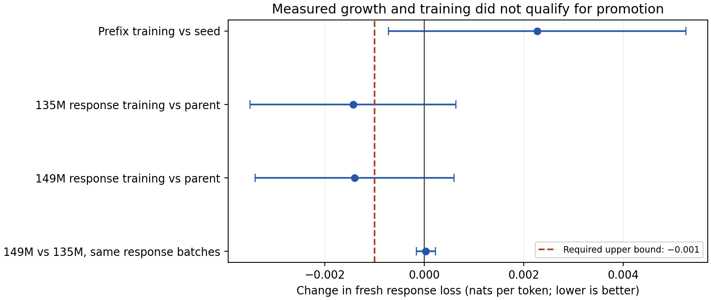

# September 11, 2026: full-model evolution experiments

These are research measurements, not the public testnet's serving checkpoint or token balances. The two-host runs used four virtual CPUs and 16 GiB RAM per host under one operator. Each guest reports two cores with two threads per core; the processors are Intel Xeon Platinum 8259CL and 8175M. [Hardware details](hardware.json) identify the tested machines without asserting compatibility with every CPU or GPU. Three or four worker allocations were capped at 48,000,000 resident parameters each. The real seed has 134,515,008 parameters; identity depth growth adds 14,160,384.

## What the results establish

- [Model conformance](model-conformance.json): the partitionable implementation matches tested Hugging Face logits exactly; initial growth preserves them and needs a fourth allocation under the declared cap.
- [Cross-host training](cross-host-conformance.json): full-model gradients and updates run through three workers; each stage replays exactly. Compact structural checks take 0.0246 seconds in this run; they do not establish arithmetic correctness by themselves.
- [Native dispute](native-conformance-v2.json): four validators on two hosts reject a forged optimizer update, accept valid work, and issue 1,000,000 experimental atoms. Publishing replay inputs takes 170,169,856 bytes and 184 upload/seal transactions. One operator controls this experiment.
- [Real-model native growth](native-growth-check.json), [genesis](native-growth-genesis.json): four validators on **one host**, using source from commit `02cbc51`, reject forged training and growth, accept valid growth to 148,675,392 parameters, then pay the next training step at the existing round. Growth needs one 14,161,224-byte parent block for its referee. The two valid training steps issue 2,000,000 atoms; growth issues none. A restart and block-header check includes application state after the final payment.
- [Latest native regression](native-dedup-check.json), [genesis](native-dedup-genesis.json): the small synthetic lifecycle also passes after adding the paid-task index. A separate fixed-point unit test verifies that unchanged weights cannot collect another reward through new ancestry. This synthetic proof cost is not substituted for the full-model measurement.
- [Later model check](latest-model-check.json) and [native check](latest-native-check.json): the public reproduction scripts pass. These checks ran on **one host** before the paid-task index was added. The native script used a **10,384-parameter synthetic fixture**, so its small proof size must not replace the real-model dispute cost.
- [S3 publication](s3-publication.json): the fresh response-training window, source and document provenance total 514 objects / 1,466,422 bytes; every object passes read-back verification. The replica uses `datasets/evolution/v1/sha256` in the existing training bucket. Read access remains governed by the bucket; these are immutable identities, not new public gateway URLs.

## The quality result is negative

The first experiment scored all next tokens in 64-token prefixes. Most examples contained no assistant response. Its [losses](evaluation-values.json) and [comparisons](quality-results.json) are retained as a misleading proxy, not as evidence of better answers.

The corrected experiment scores actual first-assistant-response positions, masking prompts and padding. It keeps up to 64 preceding context tokens and 64 response tokens, with 128 positions per example. It uses 64 paired examples in each of retention, fresh and untouched-test groups. It compares the original seed, the prefix-trained parent, a 135M response-trained candidate and a 149M response-trained candidate.

Both response candidates use the same 32 batches of two examples, SGD learning rate 0.003 and global norm cap 1.0. Neither passes the predefined fresh-response gate: the approximate 99% upper bound must be below -0.001 nats. Both satisfy the retention tolerance of +0.02 nats. The larger candidate shows no demonstrated fresh-loss advantage over the smaller candidate under the same training budget. Relative to the original seed, both candidates also fail promotion.



The paired measurements are [seed](response-evaluation-seed.json), [parent](response-evaluation-base32.json), [135M candidate](response-evaluation-response_a.json), and [149M candidate](response-evaluation-response_b.json). [Computed decisions](response-quality-results.json) preserve all six comparisons. The 99% normal intervals are approximate and uncorrected for multiple comparisons. These narrow teacher-forced losses do not measure broad reasoning, truthfulness, safety or autonomous task completion.

All three evaluation groups are disjoint hash partitions of the same pinned upstream test split. Their names do not establish new factual knowledge or retention across different historical domains. A production quality policy additionally needs a cumulative statistical error budget, durable domain reference checkpoints, and independent contamination controls.

## Exploratory follow-up from the original seed

A [plan recorded before training](response-from-seed-plan.json) specified a separate 32-step run from the original 135M seed, using SGD learning rate 0.03, the same response masking and clipping, later source rows, and 128 previously unused paired examples per evaluation group. This is an exploratory follow-up to unsuccessful runs, not an independently preregistered confirmatory study. Its thresholds were fixed before this run and were not relaxed afterward.

| Group | Seed loss | Candidate loss | Paired change | Approx. 99% upper bound |
| --- | ---: | ---: | ---: | ---: |
| Retention | 1.244962 | 1.249179 | +0.004217 | +0.011743 |
| Fresh | 1.129396 | 1.138708 | +0.009312 | +0.017282 |
| Untouched test | 1.311664 | 1.313363 | +0.001700 | +0.009115 |

**Promotion was rejected.** The retention allowance passes, but fresh response loss increases and fails the required upper bound below -0.001. This run does not establish learning improvement, and it contains no model-growth control. All three stages of the final training step replay exactly; correct execution does not make this candidate eligible to serve.

The [baseline values](response-from-seed-evaluation-baseline.json), [candidate values](response-from-seed-evaluation-candidate.json), [decision](response-from-seed-decision.json), [steps](response-from-seed-steps.jsonl), [candidate commitment](response-from-seed-candidate.json), [replays](response-from-seed-audits.json), [data windows](response-from-seed-data.json) and [selection](response-from-seed-selection.json) preserve the complete measured comparison. The candidate root is `afa31f9ab294d9f5749e4c670799e3f77492307664e5c123f76331b00e67e8f4`.

A later [current-source resume check](response-from-seed-resume-check.json) repeats the three final-step replays and derives the identical decision from cached values, without adding training steps or resampling. That check establishes recovery/replay behavior; it is not a second evaluation of model quality.

## Data and selection

The source is `HuggingFaceTB/smol-smoltalk`, revision `f73fe857d519ff6ac5af2ea67c4d3834da7b8bcc`, declared Apache-2.0. The tokenizer/model revision is `12fd25f77366fa6b3b4b768ec3050bf629380bac` of `HuggingFaceTB/SmolLM2-135M-Instruct`; the importer verifies eight pinned file digests. No arbitrary model Python code runs.

| Run | Training source rows | Held-out source rows | Objective |
| --- | --- | --- | --- |
| Initial prefix run | train 768–1151 | test 0–767 | All next tokens, 64-position prefixes |
| Response correction | train 1152–1535 | test 768–1535 | Masked response targets, 128 positions |
| Follow-up from seed | train 1536–1919 | test 1536–2303 | Masked response targets, 128 positions |

Rows are zero-indexed and inclusive in this table. Each training corpus collects 128 historical/replay documents followed by 256 fresh documents. The first batch selector uses seed `neuroshard/evolution/first-candidate/v1` and samples 96 windows; the parent trains on its first 64 windows. The response selector uses `neuroshard/assistant-targets/paired-control/v1` and samples 64 windows with a 25% historical replay fraction. Near-duplicate filtering happens at the document level before window assignment. [A cross-corpus check](cross-corpus-dedup.json) found no exact or SimHash-distance-at-most-three overlaps between the earlier training documents and the corrected evaluation pool; semantic overlap and pretraining contamination remain possible.

The follow-up uses selector `neuroshard/response-from-seed/v1`, 64 training windows and the same 25% historical replay fraction. It starts from the seed, not either previously trained candidate. Its selection beacon is generated locally after the candidate exists; it is not a native-chain randomness proof.

The [response corpus](response-corpus.json) records the ordered training-window roots. The [selection record](response-evaluation-selection.json) fixes all four model roots and the local random beacon used after those checkpoints existed. It is a local research selector, not a native-chain randomness proof. Evaluation documents are protected from training in this corpus and used once for selection; a future experiment must use new examples. The fixed records permit reproducing this historical comparison, not repeatedly claiming fresh evidence from the same test.

Training records are [prefix steps](candidate-steps.jsonl), [135M response steps](response-a-steps.jsonl), and [149M response steps](response-b-steps.jsonl). Candidate summaries include sampled independent replays: [135M](response-a-candidate.json), [149M](response-b-candidate.json). Only the sampled stages were independently replayed for those final response-training steps; full graph structure was checked for every step.

## Reproduction and provenance limits

Follow [the execution guide](../../../EVOLUTION_PROTOCOL.md) for pinned dependencies, fresh homes, remote worker configuration and the model/native scripts. The response experiment's data offsets, selectors, optimizer, batches and model ancestry are recorded above; large tensor archives and operational keys are not checked into Git. Reconstructing the historical candidates requires retraining or separately obtaining their hash-verified component objects. The epoch controller executes the same collection/training/evaluation mechanism, but a new run deliberately selects new evaluation examples.

The original native test failed because CPU dispatch was initialized before the declared profile, causing even an honest trace to fail replay. It was corrected and rerun as native experiment v2. [Native source hashes](native2-source-hashes.json) and [response source hashes](response-source-hashes.json) identify the respective frozen experiment snapshots. Source overlays are included for [native v2](native2-source.tar.gz), [the paired response experiment](response-source.tar.gz), and [the later response-from-seed experiment](response-c-source.tar.gz). All other Python modules in those snapshots were checked byte-for-byte against commit `cc2369aa9daea9250eb7248cd2e2c06d369ebee8`. Extract an overlay onto a separate checkout of that commit to recover the corresponding source tree; never overlay a running validator checkout. Later reproduction checks and timings are identified separately.

`scripts/experiment_evolution_response.py` reproduces the bounded follow-up with three HTTP worker endpoints. Pass the recorded plan and, to repeat the historical comparison, the recorded selection. Omitting the historical selection draws new evaluation examples and does not reproduce the original measurement. See the execution guide for the complete command and requirements.

Recompute statistics and the standalone PDF/SVG/PNG figure with the optional `matplotlib==3.10.9` plotting dependency:

```bash
PYTHONPATH=src python scripts/report_evolution_quality.py --results docs/eval/results/evolution20260911
```

The experimental native learning registry settles growth and training. Its serving registry has not yet integrated rolling data, quality adjudication or paid inference for these model roots. The public 0.4.0 chain continues operating its existing model. No candidate in these measurements qualifies for promotion.
